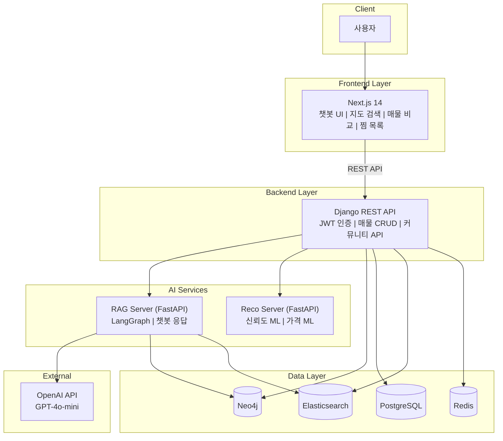
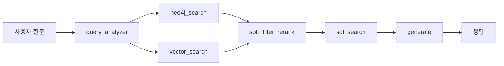

<p align="center">
  
</p>

<h1 align="center">🏠 GoZip - 부동산 매물 추천 AI 플랫폼</h1>

<p align="center">
  <strong>AI 기반 부동산 매물 검색 및 추천 서비스</strong><br/>
  서울특별시 부동산 매물 데이터를 기반으로 최적의 매물을 추천하는 지능형 플랫폼
</p>

<p align="center">
  <a href="https://goziphouse.com/">🌐 웹사이트 바로가기</a>
</p>

<p align="center">
  
  
  
  
  
</p>

<p align="center">
  
  
  
  
  
</p>

---

## 팀 소개

<table align="center">
  <tr>
    <td align="center"><b>이름</b></td>
    <td align="center"><b>역할</b></td>
    <td align="center"><b>주요 업무</b></td>
    <td align="center"><b>GitHub</b></td>
  </tr>
  <tr>
    <td align="center"><b>이태호</b></td>
    <td align="center">PM</td>
    <td>Elasticsearch, RAG, Frontend, Backend</td>
    <td align="center"><a href="https://github.com/william7333">@william7333</a></td>
  </tr>
  <tr>
    <td align="center"><b>최은정</b></td>
    <td align="center">APM</td>
    <td>중개사 신뢰도 ML, DevOps, Frontend, Backend</td>
    <td align="center"><a href="https://github.com/eunjeong0911">@eunjeong0911</a></td>
  </tr>
  <tr>
    <td align="center"><b>임연희</b></td>
    <td align="center">팀원</td>
    <td>실거래가 분류 ML, DevOps, Frontend, Backend</td>
    <td align="center"><a href="https://github.com/yheeeon">@yheeeon</a></td>
  </tr>
  <tr>
    <td align="center"><b>김수미</b></td>
    <td align="center">팀원</td>
    <td>중개사 신뢰도 ML, Frontend, Backend</td>
    <td align="center"><a href="https://github.com/ghyeju0904">@ghyeju0904</a></td>
  </tr>
  <tr>
    <td align="center"><b>김담하</b></td>
    <td align="center">팀원</td>
    <td>Neo4j, RAG, Frontend, Backend</td>
    <td align="center"><a href="https://github.com/DamHA-Kim">@DamHA-Kim</a></td>
  </tr>
  <tr>
    <td align="center"><b>조준호</b></td>
    <td align="center">팀원</td>
    <td>실거래가 분류 ML, Frontend, Backend</td>
    <td align="center"><a href="https://github.com/lemondear">@lemondear</a></td>
  </tr>
</table>

---

## 목차

- [프로젝트 소개](#프로젝트-소개)
- [핵심 기능](#핵심-기능)
- [데이터 규모](#데이터-규모)
- [기술 스택](#기술-스택)
- [시스템 아키텍처](#시스템-아키텍처)
- [ML 모델](#ml-모델)
- [RAG 챗봇](#rag-챗봇)
- [온도 지표](#온도-지표환경-점수)
- [배포 아키텍처](#배포-아키텍처)
- [문서](#문서)

---

## 프로젝트 소개

**부동산 매물 추천 AI 플랫폼**은 서울특별시 부동산 매물 데이터를 기반으로 사용자에게 최적의 매물을 추천하는 지능형 플랫폼입니다.

### 핵심 가치

- **AI 기반 추천**: 머신러닝 모델을 활용한 중개사 신뢰도 평가 및 가격 적정성 분석
- **RAG 챗봇**: LangGraph 기반 대화형 매물 검색 및 추천 서비스
- **하이브리드 검색**: Elasticsearch 전문 검색 + Neo4j 그래프 검색의 결합
- **그래프 DB**: Neo4j를 활용한 매물-시설 간 관계 기반 검색
- **실시간 분석**: Elasticsearch를 통한 매물 통계 및 트렌드 분석

### 프로젝트 배경

#### 설문조사 결과 (125명 대상)

**1️⃣ 타 서비스 이용 불편사항**

| 불편사항 | 비율 |
|:--------:|:----:|
| **허위매물** | 58.3% |
| UI/UX | 16.7% |
| 정보부족 | 12.5% |
| 기타 | 8.3% |
| 매물관리 | 4.2% |

**2️⃣ 신규 서비스 희망 기능**

| 희망 기능 | 비율 |
|:---------:|:----:|
| **허위매물 판별** | 25.0% |
| **매물비교/추천** | 21.4% |
| 기타 | 17.9% |
| 검색/필터 개선 | 14.3% |
| 후기/리뷰 | 10.7% |
| 실거래가 | 7.1% |
| 사진/정보 | 3.6% |

### 설문조사 기반 구현 기능

| 문제점 | 해결책 | 구현 |
|:------:|:------:|:-----|
| 허위매물 | 중개사 신뢰도 모델 | 거래성사율, 운영기간, 자격구분 → 골드/실버/브론즈 등급 분류 |
| 가격 불투명 | 가격 적정성 모델 | 지역별 시세 대비 → 저렴/적정/비쌈 자동 분류 |
| 복잡한 검색 | AI 챗봇 | 자연어 기반 매물 검색 + 하이브리드 검색 |
| 불편한 UI | 직관적 UX | 채팅으로 바로 검색 + 매물 동시 비교 화면 |

---

## 핵심 기능

<table>
<tr>
<td width="50%">

### 1. AI 챗봇 (RAG)

- 자연어 기반 매물 검색
- LangGraph 기반 질문 분류 및 응답
- Neo4j + Elasticsearch 하이브리드 검색

### 2. 중개사 신뢰도 분석

- **골드/실버/브론즈** 등급 자동 분류
- **F1-macro 0.74**

</td>
<td width="50%">

### 3. 가격 적정성 분석

- **저렴/적정/비쌈** 자동 분류
- **F1-macro 0.73**
- 지역×건물용도별 상대 시세 비교

### 4. 온도 지표

- 안전 / 생활편의 / 교통 / 문화 / 반려동물
- 각 항목 점수화 후 온도(°C)로 표시
- 평균 기준선: 36.5°C

</td>
</tr>
</table>

---

## 데이터 규모

<table align="center">
<tr>
<td align="center"><b>총 매물</b><br/><h2>30,000+</h2></td>
<td align="center"><b>중개사무소</b><br/><h2>400+</h2></td>
<td align="center"><b>커버리지</b><br/><h2>서울 25개구</h2></td>
</tr>
</table>

### 데이터 소스

| 데이터 출처 | 설명 | 용도 |
|:-----------:|:-----|:-----|
| **직방 API** | 서울시 월세/전세 원룸 매물 | 실시간 매물 정보 |
| **피터팬** | 서울시 부동산 매물 크롤링 | 매물 상세 정보 |
| **V-WORLD API** | 중개업소/중개업자 정보 | 중개사 신뢰도 모델 학습 |
| **서울시 열린 데이터** | 월세 실거래가 + 한국은행 금리 | 가격 적정성 모델 학습 |
| **공공 데이터** | CCTV, 범죄 통계, 시설, 교통 | 온도 지표 산출 |

---

## 기술 스택

### Frontend

- **Framework**: Next.js 14 (App Router)
- **Language**: TypeScript
- **Styling**: Tailwind CSS
- **State Management**: React Context API
- **Map**: Kakao Map API
- **Authentication**: NextAuth.js (Google OAuth)

### Backend

- **Framework**: Django 4.2 + Django REST Framework
- **Language**: Python 3.11
- **API**: FastAPI (RAG 서버, 추천 서버)
- **Authentication**: JWT (djangorestframework-simplejwt)

### Database

- **Relational DB**: PostgreSQL 16 + pgvector (벡터 검색)
- **Graph DB**: Neo4j 5.15 (APOC 플러그인)
- **Cache**: Redis 7

### Search Engine

- **Elasticsearch 8.17**
  - **하이브리드 검색**: 키워드 + k-NN 벡터 검색 결합
  - **텍스트 재정렬**: Neo4j 후보를 텍스트 기반 재정렬
  - **한글 분석**: Nori Analyzer (형태소 분석)
  - **벡터 검색**: text-embedding-3-large (3072차원)
  - **점수 조합**: Neo4j 60% + ES 40%

### AI/ML

- **LLM**: OpenAI GPT-4, gpt-4o-mini
- **Framework**: LangChain, LangGraph
- **ML Libraries**: scikit-learn, LightGBM, XGBoost, SHAP
- **Embeddings**: OpenAI text-embedding-ada-002

### Infrastructure

- **Containerization**: Docker, Docker Compose

### Development Tools

- **Package Manager**: uv (Python), npm (Node.js)
- **Version Control**: Git, GitHub
- **Analytics**: Jupyter Notebook

---

## 시스템 아키텍처



### 데이터 흐름

**1️⃣ 매물 검색 흐름**

```
사용자 → Frontend → Backend → Neo4j/Elasticsearch
                              ↓
              하이브리드 검색 (Neo4j 60% + ES 40%)
                              ↓
              Backend → Frontend → 사용자
```

**2️⃣ 챗봇 대화 흐름**

```
사용자 질문 → Frontend → RAG Server → LangGraph Pipeline:
   ├── 1. query_analyzer_node (질문 분류/의도 추출)
   ├── 2. neo4j_search_node + vector_search_node (병렬 검색)
   ├── 3. soft_filter_rerank_node (재정렬 및 랭킹)
   ├── 4. sql_search_node (상세 정보 조회)
   └── 5. generate_node (LLM 응답 생성)
→ Frontend → 사용자
```

**3️⃣ ML 모델 추론 흐름**

```
매물 데이터 → Reco Server
   ├── Trust Model (중개사 신뢰도: 골드/실버/브론즈)
   └── Price Model (가격 적정성: 저렴/적정/비쌈)
→ Backend → Frontend
```

---

## ML 모델

### 1️⃣ 중개사 신뢰도 모델 (Trust Model)

**목적**: 부동산 중개사의 신뢰도를 금/은/동 등급으로 분류

#### 데이터

- **출처**: 크롤링 데이터 + V-WORLD API (중개업소 정보, 중개업자 정보)
- **규모**: 약 400개 중개사무소
- **매칭**: 3단계 매칭 (중개사무소명+대표자명, 등록번호+중개사무소명, 중개사무소명+대표자명)

#### 타겟 생성

```python
# 1. 거래성사율 계산
거래성사율 = 거래완료 / (거래완료 + 등록매물)

# 2. 지역별 표준화 (Z-score)
Performance_Zscore = (거래성사율 - 지역평균) / 지역표준편차

# 3. 자격점수 표준화
Qual_Zscore = (자격점수 - 평균) / 표준편차

# 4. 복합 Z-score (성사율 70% + 자격 30%)
Zscore = Performance_Zscore * 0.7 + Qual_Zscore * 0.3

# 5. 대표자구분 가중치 적용
대표자구분_가중치 = {
    '공인중개사': 0.0,
    '법인': +0.2,
    '중개보조원': -0.1,
    '중개인': -0.3
}
Zscore_조정 = Zscore + 대표자구분_가중치

# 6. 등급 분류 (Train 기준 분위수)
금등급: 상위 30% (Zscore_조정 > 70th percentile)
은등급: 중위 40% (30th ~ 70th percentile)
동등급: 하위 30% (Zscore_조정 < 30th percentile)
```

### Feature (총 14개)

**1. 실적 지표 (3개)** - log 변환 적용

- 등록매물_log
- 총거래활동량_log
- 1인당_거래량_log

> **log 변환 이유:**  
> 거래량 데이터는 왜도(Skewness)가 심함 (소수가 매우 많고, 대다수가 적음)  
> → log 변환으로 이상치 영향 감소 및 스케일 정규화

**2. 인력 지표 (3개)**

- 총_직원수
- 중개보조원_비율
- 자격증_보유비율

**3. 경험 지표 (3개)**

- 운영기간_년
- 숙련도_지수
- 운영_안정성

**4. 구조 지표 (1개)**

- 대형사무소

**5. 대표자 자격 (2개)**

- 대표_공인중개사
- 대표_법인

**6. 지역 지표 (2개)**

- 지역_경쟁강도
- 1층_여부

#### 모델 성능

**최종 성능 지표:**

- Test Accuracy: **73.24%**
- Train Accuracy: 80.43%
- 과적합 정도: 7.19%
- CV Mean: 74.76% (±7.60%)

**등급별 성능 (Test 기준):**

| 등급 | Precision | Recall | F1-Score |
|:----:|:---------:|:------:|:--------:|
| 브론즈 등급(0) | 0.62 | 0.94 | 0.75 |
| 실버 등급(1) | 0.75 | 0.69 | 0.72 |
| 골드 등급(2) | 0.87 | 0.65 | 0.74 |

**특징:**

- 브론즈 등급(신뢰도 낮음) 재현율이 가장 높음 (94%) - 문제 중개사 잘 감지
- 골드 등급(신뢰도 높음) 정밀도가 가장 높음 (87%) - 우수 중개사 정확히 분류

#### 알고리즘

- **모델**: Logistic Regression
- **최적화**: GridSearchCV (144개 조합)
- **하이퍼파라미터**: C=1, penalty='l1', solver='saga', class_weight='balanced'


---

### 2️⃣ 가격 적정성 모델 (Price Model)

> **목적**: 월세 매물의 가격을 저렴/적정/비쌈으로 분류

<table>
<tr>
<td width="50%">

#### 모델 비교 (Test F1-Macro)

| 모델 | F1-Macro | Accuracy |
|:----:|:--------:|:--------:|
| **LightGBM** | **0.7317** | **73.46%** |
| XGBoost | 0.6854 | 68.80% |
| LSTM | 0.6715 | 67.04% |

</td>
<td width="50%">

#### 혼동행렬 (LightGBM)

| 등급 | 저렴 | 적정 | 비 |
|:----:|:---------:|:------:|:--:|
| 저렴 | 0.85 | 0.13 | 0.02 |
| 적정 | 0.24 | 0.63 | 0.13 |
| 비쌈 | 0.02 | 0.24 | 0.73 |

</td>
</tr>
</table>

#### SHAP 분석 TOP-3

1. **보증금_지역대비** - 지역 평균 대비 상대적 가격
2. **임대면적** - 면적 차이로 가격 등급 변화
3. **자치구_월별_임대료수준_구간** - 최근 지역 임대료 수준


---

## RAG 챗봇

### LangGraph 파이프라인



### 노드 구성

| 노드 | 파일 경로 | 역할 |
|:----:|:----------|:-----|
| query_analyzer_node | apps/rag/nodes/query_analyzer_node.py | 사용자 질문 분류 및 의도/엔티티 추출 |
| neo4j_search_node | apps/rag/nodes/neo4j_search_node.py | Neo4j 기반 관계·거리 검색 (후보 탐색) |
| sql_search_node | apps/rag/nodes/sql_search_node.py | PostgreSQL에서 매물 상세 조회 |
| es_search_node | apps/rag/nodes/es_search_node.py | Elasticsearch 텍스트/벡터 검색 및 후보 수집 |
| vector_search_node | apps/rag/nodes/vector_search_node.py | 임베딩 기반 유사도 검색 (벡터 검색) |
| soft_filter_rerank_node | apps/rag/nodes/soft_filter_rerank_node.py | 텍스트 재정렬 및 소프트 필터 적용 (랭킹 보정) |
| generate_node | apps/rag/nodes/generate_node.py | LLM 호출 및 응답 생성·포맷팅 (최종 출력) |
| style_mapping | apps/rag/nodes/style_mapping.py | 응답 스타일/포맷 매핑 (선택적 후처리) |

### 주요 기능

| 기능 | 설명 | 예시 |
|:----:|:-----|:-----|
| **자연어 검색** | 하드필터 + 소프트필터 동시 처리 | "홍대역 근처 깨끗한 원룸" |
| **허위매물 분석** | 중개사 신뢰도 등급 제공 | 골드/실버/브론즈 |
| **가격 분석** | 지역×용도별 시세 비교 | 저렴/적정/비쌈 |
| **랭킹 시스템** | 1순위~3순위 매물 추천 | 거리+가격+온도 종합 |

### RAG 챗봇 검증

벤치마크 테스트를 통해 응답 품질 검증:

- 복합 쿼리 성능 (위치 + 가격 + 편의시설)
- Neo4j 그래프 검색 정확도
- LLM 응답 생성 품질
- 검색 결과와 응답 일관성

---

## 온도 지표(환경 점수)

온도 지표는 매물의 다양한 생활 요소를 한눈에 보여주기 위한 상대 점수입니다. 각 항목은 해당 범주의 세부 메트릭을 정규화하여 가중합한 후, 전체 매물 분포 대비 상대 위치를 온도(°C)로 표시합니다. 평균 기준선은 약 36.5°C입니다.

<table>
<tr>
<td width="20%" align="center">🛡️<br/><b>안전</b></td>
<td>범죄 위험도 + 안전 인프라 (CCTV, 경찰서, 비상벨)</td>
</tr>
<tr>
<td align="center">🛒<br/><b>생활편의</b></td>
<td>편의점, 마트, 세탁소 등 필수 편의시설 접근성</td>
</tr>
<tr>
<td align="center">🚇<br/><b>교통</b></td>
<td>지하철역 이용량, 노선 수, 버스정류장 수, 업무지구 거리</td>
</tr>
<tr>
<td align="center">🎨<br/><b>문화</b></td>
<td>영화관, 미술관, 공연장, 도서관, 공원 접근성</td>
</tr>
<tr>
<td align="center">🐾<br/><b>반려동물</b></td>
<td>동물병원, 펫샵, 반려동물 놀이터, 산책로 접근성</td>
</tr>
</table>

<p align="center">
  
</p>

---

## 배포 아키텍처

<p align="center">
  
</p>

---

## 문서

<details>
<summary><b>아키텍처 및 설계</b></summary>

- [Architecture_Diagrams.md](docs/Architecture_Diagrams.md) - 전체 시스템 아키텍처
- [erd.md](docs/erd.md) - 데이터베이스 ERD
- [graph_schema.md](docs/graph_schema.md) - Neo4j 그래프 스키마
- [폴더구조.md](docs/폴더구조.md) - 프로젝트 폴더 구조

</details>

<details>
<summary><b>API 및 백엔드</b></summary>

- [api_spec.md](docs/api_spec.md) - API 명세서
- [API_TEST_RESULTS.md](docs/API_TEST_RESULTS.md) - API 테스트 결과
- [backend_readme.md](docs/backend_readme.md) - 백엔드 개발 가이드

</details>

<details>
<summary><b>기능 구현</b></summary>

- [FILTER_FEATURE.md](docs/FILTER_FEATURE.md) - 매물 필터링 기능
- [MAP_FEATURE.md](docs/MAP_FEATURE.md) - 지도 기능
- [README_CHATBOT.md](docs/README_CHATBOT.md) - 챗봇 기능 가이드

</details>

<details>
<summary><b>ML 모델</b></summary>

- [PRICE_ML_MODEL.md](docs/PRICE_ML_MODEL.md) - 가격 적정성 모델
- [trust_model/README.md](apps/reco/trust_model/README.md) - 중개사 신뢰도 모델
- [MODEL_APPLICATION_README.md](docs/MODEL_APPLICATION_README.md) - 모델 적용 가이드

</details>

<details>
<summary><b>개발 환경</b></summary>

- [START.md](START.md) - 빠른 시작 가이드
- [DOCKER_DEPLOYMENT_GUIDE.md](docs/DOCKER_DEPLOYMENT_GUIDE.md) - Docker 배포 가이드

</details>

---

<p align="center">
  <b>SKN18-FINAL-1TEAM</b> - SK Networks Family AI Camp 18기 최종 프로젝트
</p>

<p align="center">
  Made with by GoZip Team
</p>
